# earshot user guide

earshot sends a file from one device to the one next to it, as sound. The
sending device plays the file through its speaker; the receiving device
listens through its microphone, rebuilds the bytes, checks them, and offers
the file to save. There is nothing to install and no network involved: both
devices open the same web page. This guide is for the person doing the
transfer. The [README](../README.md) is for whoever wants to know how it
works inside.

Every screenshot here, and every table under a heading marked *generated*, is
produced from the page by `npm run guide`. `npm test` fails when the page has
changed and this guide has not, so what you see here is what you get.

## What to expect

- It is slow. Sound through air is a narrow channel: a few hundred bytes a
  second, so a note or a key is seconds, a document a minute or two, a photo
  a quarter of an hour. The table in
  [How long it takes](#how-long-it-takes-generated) has the numbers.
- It is audible. The sender plays a short upward sweep, then about two
  seconds of dense, hiss-like tone, over and over until you stop it.
- It is a broadcast. Anyone within earshot who has this page open receives
  what you send. Set a passphrase when that matters; see
  [Passphrase](#passphrase).
- Both devices should sit still, close together, in a quiet room. A phone
  waved about shifts the pitch of what it hears, and the receiver has to
  chase it.

## Open the page

Open **https://neerajmg.github.io/earshot/** on both devices. The published
page is served over HTTPS, which the browser requires before it will hand a
page the microphone; open it over plain HTTP from somewhere else and the
receive side says `microphone needs HTTPS — open the published page.`

To run it from a copy of the repository instead, in the folder that holds
`index.html`:

    python3 -m http.server 8000

and open http://localhost:8000 (`localhost` counts as secure). Serve it, do
not double-click `index.html`: the receiver runs in a worker and an audio
worklet, and browsers will not load those from a file on disk.

It was built and tested in Chrome. On a phone you can add it to the home
screen and it opens full screen, like an app.

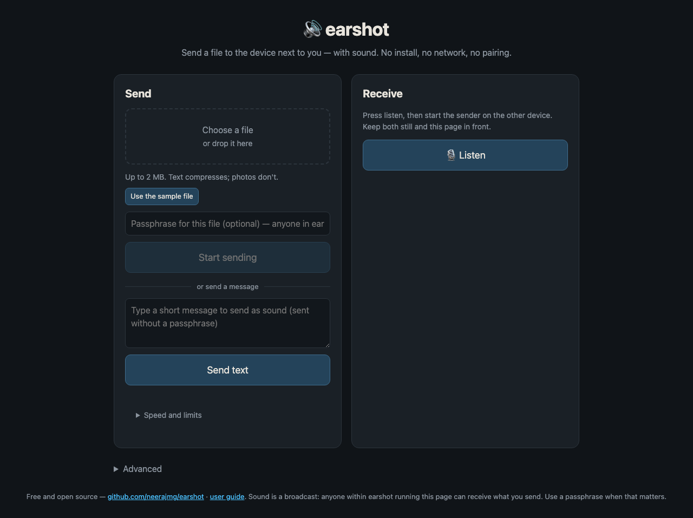

**Send** is one card, **Receive** the other; on a phone they stack. Each
device uses one of the two. **Advanced**, under them, opens the engine line,
a spectrogram and a log, which you only need when something is wrong.

## Receive

Start the receiver first. Listening costs nothing, and the sender's first
seconds are wasted if nobody is listening yet. Starting late is not fatal,
though: every frame announces the file, so a receiver that joins part way
still gets it.

1. Press **Listen** and allow the microphone when the browser asks. The
   button turns into **Stop listening** and the status line says
   `listening… start the sender on the other device.`

   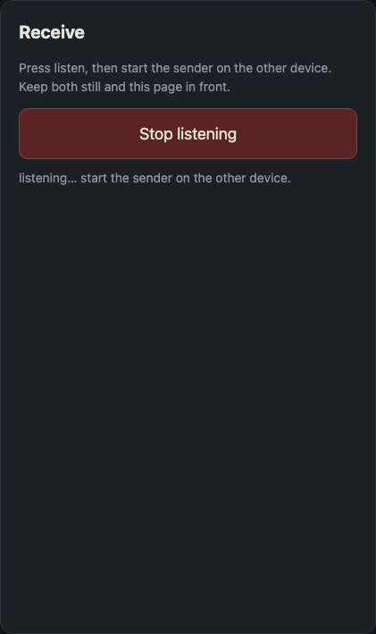

2. Keep the page in front and the device still. If you switch away, the
   browser may starve the audio; the log under **Advanced** says
   `page hidden - audio may be throttled` when that happens.
3. As frames arrive, a progress bar appears with the file's name and how
   much of it is in. The size shown there is the size on the air, after
   compression, so it is often smaller than the file.

   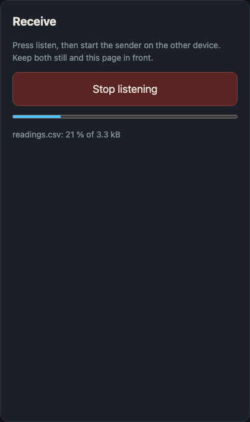

4. When the file is complete, the status says `received.`, the result box
   names the file, and listening stops by itself.
5. Press **Save file**. On a phone that offers a share sheet, that is what
   opens; otherwise the file downloads.

   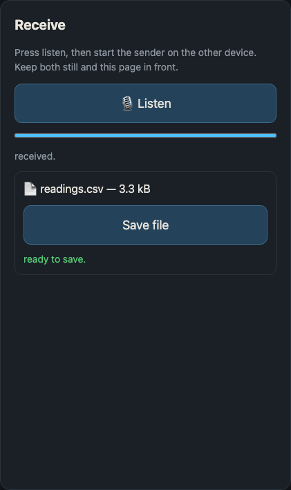

If the sender set a passphrase, the result box asks for it before
**Save file** appears; see [Passphrase](#passphrase).

## Send

1. **Choose a file**, or drop one on the box. Up to 2 MB; anything bigger
   is refused with a note saying so. The line under the box says how big
   the file is, how many frames that is, and roughly how long it will take.
   No file handy? **Use the sample file** loads a short built-in text so
   you can try a transfer in about ten seconds.

   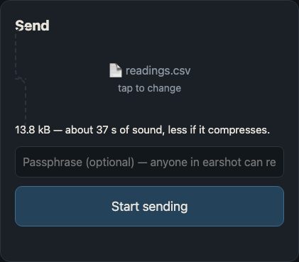

   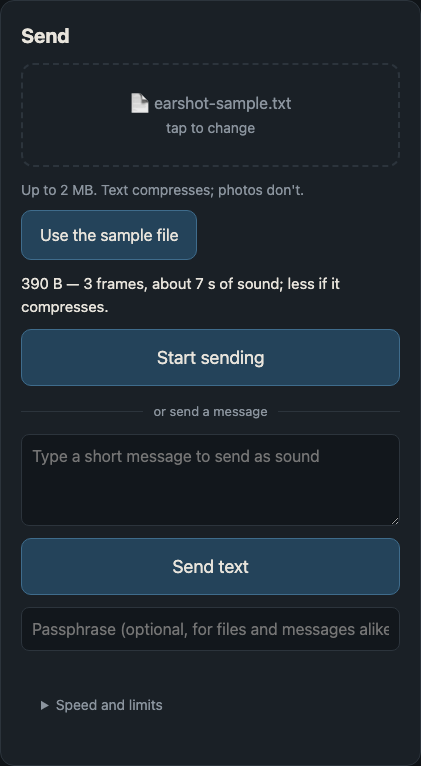

   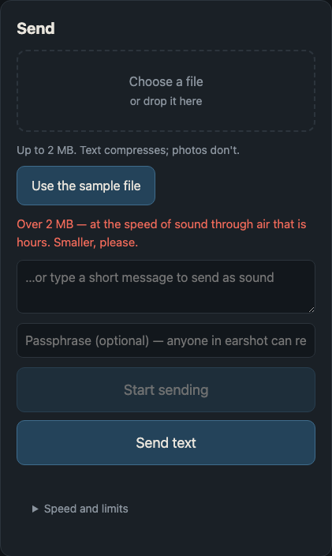

2. Optionally type a passphrase in the field at the bottom of the card,
   under **Send text**; it applies to files and messages alike. See
   [Passphrase](#passphrase).
3. Wait until the other device says it is listening, then press
   **Start sending**. The status says `preparing…` for a moment
   (compression, and encryption if you set a passphrase), then counts
   frames and the time left.
4. Volume somewhere in the middle. A speaker driven into distortion is
   worse than a quieter one, and the two devices should be close anyway.
5. **The sender does not stop by itself.** It keeps playing frames, because
   it cannot hear whether the receiver is done and extra frames only help a
   receiver that missed some. When the other device says `received.`, press
   **Stop**. Past the estimate the status adds
   `keep going until the receiver has it`.

   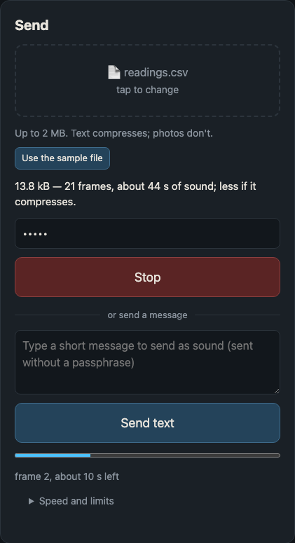

6. To send a message instead of a file, type it in the box under the file
   area and press **Send text**. It travels as a small file called
   `message.txt` and the receiver shows it on screen as soon as it lands,
   with the same **Save file** button underneath. A passphrase applies to
   messages too.

   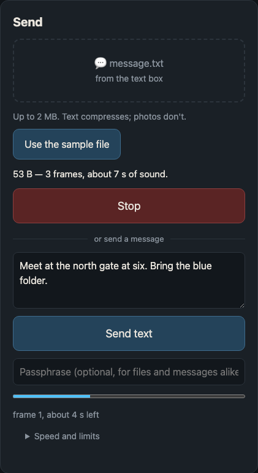

   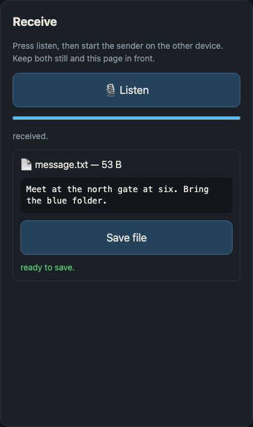

**Speed and limits**, folded under the Send card, is a table of how long
each size takes. It is computed from the frame format rather than typed in:
768 bytes of your file per 2.07-second frame, plus two spare frames, so a
1 kB message is a few seconds and the 2 MB maximum is over an hour. Real
rooms need a few extra frames when noise costs one, and text compresses
before it is sent, which is why a text file often finishes early.

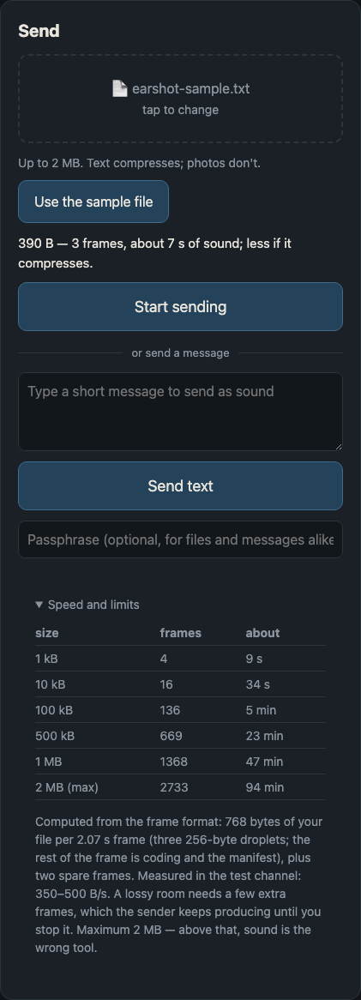

## Passphrase

Sound is a broadcast: any device in the room with this page open and
**Listen** pressed receives the file. If that matters, type a passphrase in
the Send card before you press **Start sending**. The file is encrypted with
it before it goes on the air, and nothing of the passphrase itself is
transmitted; tell the other person the passphrase some other way.

On the receiving side the transfer looks the same until it completes. Then
the result box says `encrypted by the sender.` and shows a passphrase field
with an **Unlock** button. Type the passphrase and press **Unlock**; the box
changes to `ready to save.` and **Save file** appears. A wrong passphrase is
reported, not silently decrypted into garbage, and you can try again.

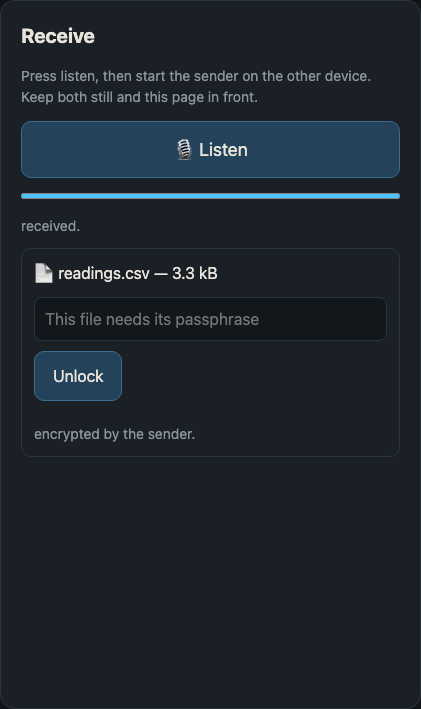

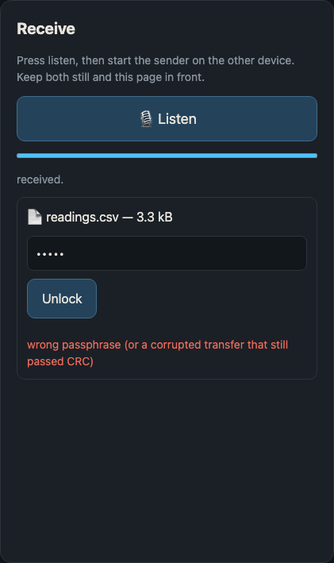

## How long it takes (generated)

<!-- gen:timing -->
| file | frames | sound |
|---|---:|---:|
| a note, a key, a config (2.0 kB) | 5 | 0:10 |
| a small document (30.0 kB) | 42 | 1:27 |
| a photo (300.0 kB) | 402 | 13:50 |
| the 2 MB ceiling (2.00 MB) | 2733 | 94:05 |

One frame is 2.07 s of sound and carries 768 bytes of the file, 372 bytes per second. The table is for a file that does not compress and a transfer that loses nothing; text usually compresses two to three times, and every lost frame adds one more.
<!-- /gen:timing -->

The estimate the page shows when you choose a file is for the file as it is,
uncompressed, with a little slack for a clean transfer; a text file usually
finishes sooner, and a noisy room makes anything take longer. What helps: the devices close together, still, and the
room quiet. What does not help: turning the volume all the way up.

## On a phone

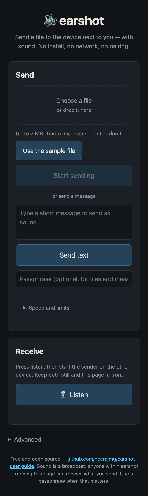

The cards stack. **Save file** opens the share sheet where there is one, so
the file can go straight to another app. The page asks the system to keep
the screen on while it is sending or listening; if the screen locks anyway,
listening stops, so keep the phone awake.

## Under Advanced

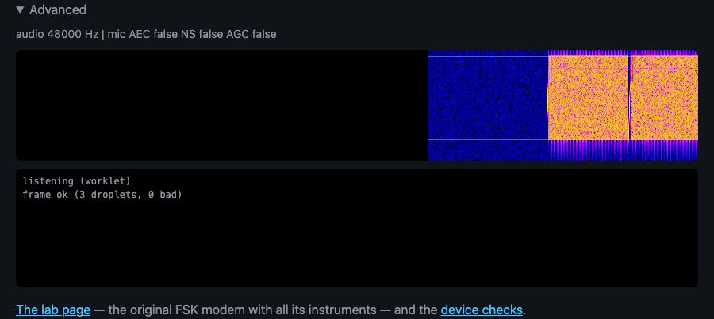

Open **Advanced** when you want to see what the engine is doing.

- The first line says the audio rate and, once listening, what the browser
  did with the microphone: `mic AEC false NS false AGC false` is what you
  want. The page asks for echo cancelling, noise suppression and automatic
  gain to be off, because all three eat the signal; a browser that keeps one
  on says `true` there.
- The spectrogram shows what the microphone hears, so it stays blank on the
  sending side. It scrolls right to left and covers 0 to 8 kHz, low at the
  bottom. The two white lines mark the edges of the signal, 1.5 and
  7.5 kHz: a good transfer is a bright band between them, in two-second
  blocks with short gaps, and not much below the lower line. A blank
  spectrogram while the other device is playing means the microphone is not
  hearing it.
- The log. `listening (worklet)` when the microphone opens; `frame ok (3
  droplets, 0 bad)` for each frame decoded, where a droplet is one of the
  three pieces of the file inside a frame and `bad` counts pieces that
  failed their check; `audio gap` when the browser dropped some audio, which
  happens when the page is in the background. On the sending side,
  `sending readings.csv: 13.8 kB -> 3.3 kB on air, encrypted` records what
  went out.

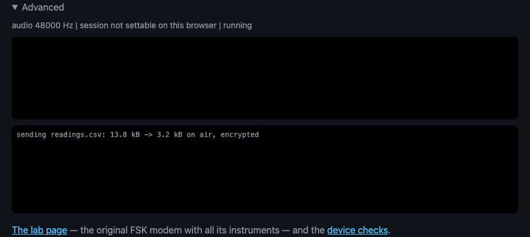

The links at the bottom of **Advanced** lead to [the lab page](LAB.md), the
original modem with all its instruments, and the device checks: a page that
measures whether this device can run audio at 48 kHz, whether its microphone
hears the whole band, the room's echo, the speaker's loudness headroom, and
a forty-minute soak of the receive pipeline.

## When it does not work

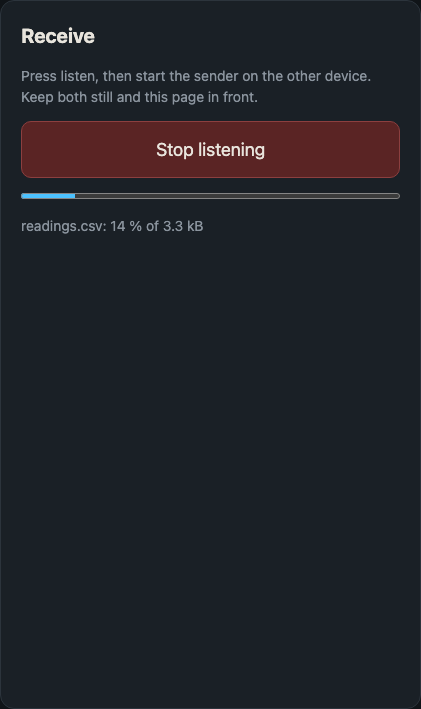

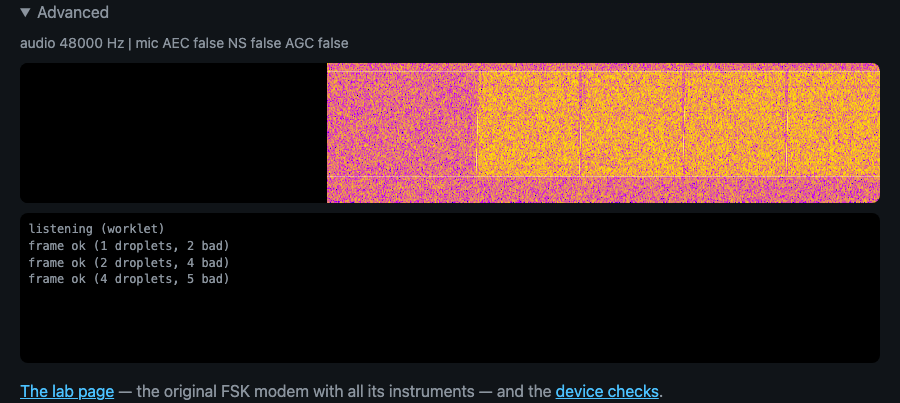

| What you see | What it means | What to do |
|---|---|---|
| `microphone needs HTTPS — open the published page.` | The page was opened over plain HTTP or from disk | Use the published page, or serve the folder and open http://localhost:8000 |
| **Listen** does nothing, or an error about the microphone | The browser has no permission, or no microphone | Allow the microphone in the browser's site settings; check the system input device |
| `listening…` and nothing else while the other device is playing | The microphone is not hearing the signal | Open **Advanced**: a blank spectrogram means no sound arrives. Sender louder and closer, nothing covering the microphone, sender's sound not going to headphones or a Bluetooth speaker |
| Progress bar appears, then stalls or creeps | Frames are being lost; `bad` counts in the log climb | Keep the sender going; it is built to fill the gaps. Closer, stiller, quieter helps more than louder |
| `audio gap` in the log, progress stalls | The page is in the background or the device is busy | Bring the page to the front and leave it there |
| `page hidden - audio may be throttled` | You switched tabs or apps | Same |
| Sender says `keep going until the receiver has it` | The estimate has passed, which is normal in a noisy room | Wait for the receiver to say `received.`, then press **Stop** |
| `wrong passphrase (or a corrupted transfer that still passed CRC)` | The passphrase differs from the sender's | Type it again, exactly; passphrases are case-sensitive |
| `Over 2 MB — at the speed of sound through air that is hours. Smaller, please.` | The file is over the limit | Send something smaller, or compress it first |
| `transfer not complete` | **Unlock** was pressed before the transfer finished | Wait for `received.` |
| **Save file** on a phone downloads instead of sharing | The share sheet was dismissed, or this browser cannot share files | It is the same file; look in the browser's downloads |

When a transfer fails in a way this table does not cover, the lab page can
record what the microphone heard as a WAV file, which is the most useful
thing to attach to a bug report; see [LAB.md](LAB.md).

## Every control

Send card, top to bottom: **Choose a file** (or drop one on the box),
**Use the sample file** beside the size note, **Start sending**, which
becomes **Stop** while sending; then an "or send a message" divider, the
message box and **Send text**; then the passphrase field, the progress bar,
the status line, and **Speed and limits** folded underneath.

Receive card: **Listen**, which becomes **Stop listening** while the
microphone is open, the progress bar and status line, and the result box
with the file's name, the text itself when it is a short text file, the
passphrase field and **Unlock** when the sender encrypted, **Save file**
when the file is ready, and a line saying which.

**Advanced** opens the engine line, the spectrogram, the log, and links to
the lab page and the device checks.

## Limits (generated)

<!-- gen:limits -->
- Files up to 2 MB (2,097,152 bytes). Bigger ones are refused before anything plays.
- File names travel as up to 64 bytes of UTF-8; longer names arrive cut short.
- Compression is gzip, used only when it saves at least 5 %; the log line under **Advanced** shows the size before and after.
- Passphrase: AES-256-GCM, key derived from the passphrase with PBKDF2-SHA-256 over 210,000 iterations, fresh salt and nonce per transfer. A wrong passphrase is detected, not silently decrypted to garbage.
- Audio runs at 48000 Hz. A device that cannot is resampled, and **Advanced** says so.
- The log under **Advanced** keeps the last 250 lines.
<!-- /gen:limits -->

## The numbers (generated)

How the sound is made, for the curious. The README's "How it works" is the
prose version.

<!-- gen:engine -->
- 1024-point FFT at 48000 Hz: subcarriers 46.875 Hz apart, bins 32 to 159 (1500 to 7453 Hz). 116 carry data as QPSK, 8 are pilots that track the two devices' clocks, 4 stay silent so the noise floor is measured every symbol.
- 37.5 symbols per second: 1024 samples plus a 256-sample cyclic prefix, so echoes up to 5.3 ms late do no harm.
- A frame: a 40 ms chirp (1500 to 5500 Hz) that the receiver finds with a matched filter, a 10 ms guard, one channel-estimation symbol, 2 signalling symbols that say what the frame is, 72 data symbols, and a 15 ms gap: 2.07 s.
- Coding: K=7 rate-1/2 convolutional, soft-decision Viterbi, each bit weighted by its subcarrier's SNR so a dead frequency counts as unknown rather than wrong. 1043 bytes come out of a frame: a 96-byte manifest (name, size, checksum, flags) and 3 droplets of 264 bytes.
- Fountain: the file is cut into 256-byte blocks and windows of 256 blocks (64 kB). Droplets are blocks, then random combinations of blocks; any enough of them rebuild a window, so a lost frame costs time, never a pass.
<!-- /gen:engine -->

## Keeping this guide current

`npm run guide product` runs `tools/make-guide.js` for this page. It prepares
a sample file (a 14 kB CSV of sensor readings, with a passphrase), opens the
page in headless Chrome, and takes the screenshots above from the live page:
the static states directly, and the receiving states by feeding the rendered
transfer to a fake microphone in real time, with a little white noise under it
so the spectrogram looks like a room. The noisy example is the same transfer
under enough noise that pieces of frames fail their checks. It then rewrites
the *generated* tables from the constants in the code and records which
versions of the page's source files it saw.

`npm test` includes a check that fails when any of those files has changed
since the last run, when a table is out of date, when a screenshot is missing
or unused, or when a button, label or disclosure on the page is not named in
this guide. Editing one of the files inside Claude Code triggers the same
check straight away, through the hook in `.claude/settings.json`.

The generator does not write sentences. After a change that a user would
notice, regenerate, then read the section it touches and fix the words.
