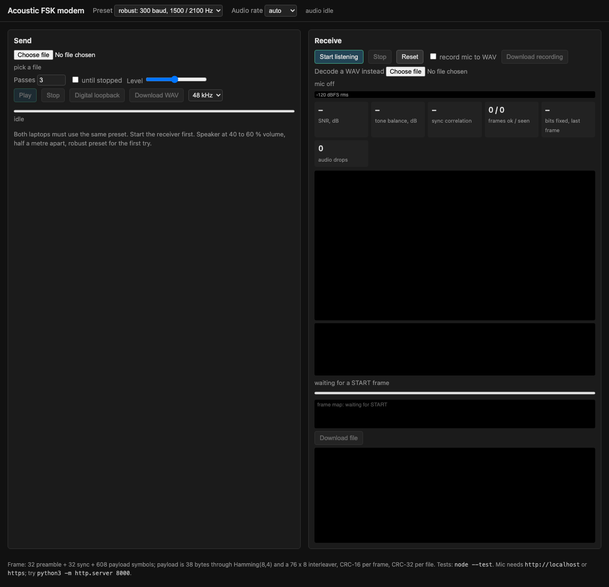
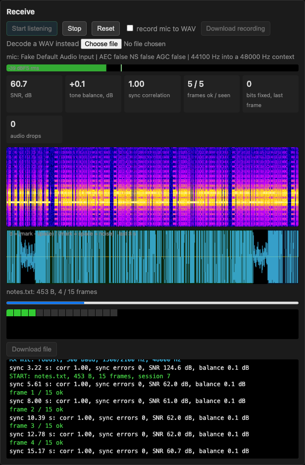
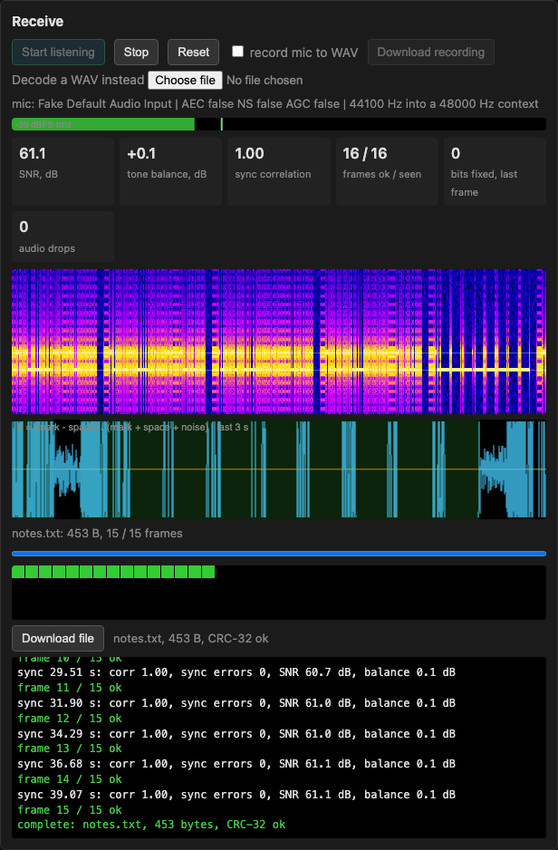
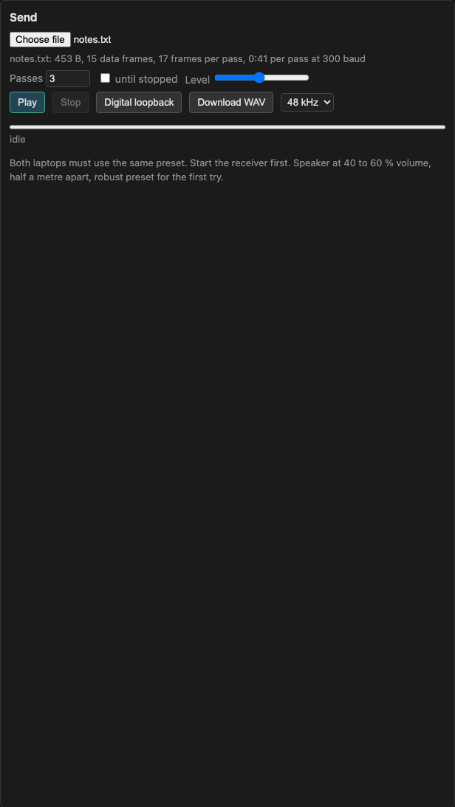
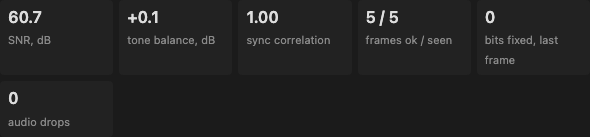
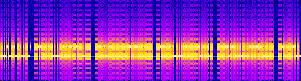
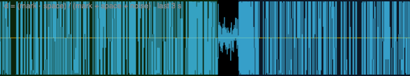
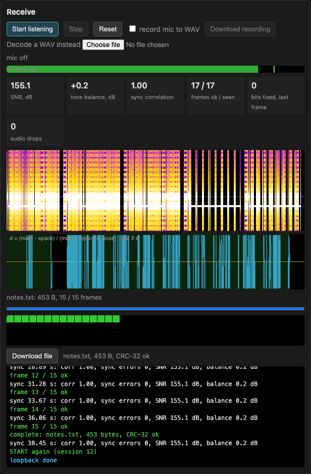
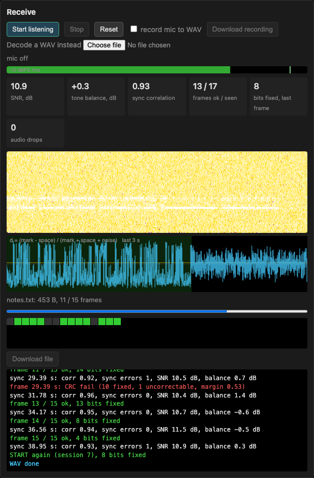

# The lab page

This is the guide to `lab.html`, the original 2-FSK modem with all its
instruments: spectrogram, decision plot, frame map, and a log of every frame.
The product page at the site root is the OFDM engine and has its own
[user guide](GUIDE.md); the lab is where the signal processing is visible,
and where recordings become test cases.

This page moves a file from one laptop to another through the air. One laptop
plays the file as sound; the other listens with its microphone and rebuilds the
bytes. Nothing is installed on either side: both open the same folder in
Chrome. This guide is for the person doing the transfer. The
[README](../README.md) covers the product; the "How it works" and "Tuning"
notes for this engine are at the top of `dsp.js` and `modem.js`.

Every screenshot here, and every table under a heading marked *generated*, is
produced from the page by `npm run guide`. `npm test` fails when the page has
changed and the guide has not, so what you see here is what you get.

## What you need

- Two laptops, each with a speaker, a microphone and Google Chrome. One laptop
  on its own is enough to try the page; see
  [Trying it on one laptop](#trying-it-on-one-laptop).
- This folder on both laptops. AirDrop, a USB stick or a zip is fine; there is
  nothing to build.
- Python 3, only to serve the folder. Any static file server does.
- A quiet room and about half a metre between the laptops.

## Open the page

On each laptop, in a terminal:

    cd "Modem file transfer"
    python3 -m http.server 8000

Then open http://localhost:8000/lab.html in Chrome.

The receiving side needs `localhost` (or `https`): Chrome only hands the
microphone to a page on a secure address. The sending side does not, so on
that laptop you can also double-click `lab.html`. If the page is opened the
wrong way, a banner across the top says so; sending, loopback and WAV decoding
still work from there.

The header holds the two settings both laptops must share, **Preset** and
**Audio rate**, and says whether audio is running. **Send** is on the left,
**Receive** on the right. Each laptop uses one of the two.

## Receive

Start the receiver first. Listening costs nothing, and the sender's first
frames are lost if nobody is listening yet.

1. Pick the **Preset** the sender will use. Start with `robust`.
2. Leave **Audio rate** on `auto`.
3. Press **Start listening** and allow the microphone when Chrome asks.
4. Read the line under the buttons. It names the microphone and should say
   `AEC false NS false AGC false`. If any of the three says `true`, Chrome kept
   some of its voice processing on. Two separate laptops usually still work;
   a laptop listening to itself will not.
5. Keep this tab in front and the laptop awake. Chrome throttles a background
   tab and the audio gets gaps. The page asks the system for a wake lock;
   `caffeinate -d` in a terminal does the same by hand.

Once frames arrive, the line under the plots names the file and counts frames,
the frame map fills in green, one square per frame, and the log shows every
frame as it comes. When every frame is in and the file's CRC-32 matches,
**Download file** lights up and the tab title changes to `received <name>`,
so you can see it from another window.

Press **Download file** to save it. **Reset** clears the receiver for the next
file; the microphone can stay on. **Stop** next to it turns the microphone
off.

## Send

1. Set the same **Preset** as the receiver.
2. Choose the file. The line under the chooser says how many frames it is and
   how long one pass takes at this preset.
3. Set **Passes**. Each pass sends the whole file again; the receiver keeps
   the frames it has and fills the gaps from later passes. Three is a good
   default in a normal room, one is enough on a quiet desk. **until stopped**
   repeats until you press **Stop**, which is handy when the receiver is slow
   to get going.
4. Leave **Level** where it is. It sets how loud the page plays into the
   laptop's volume control; the volume control does the rest.
5. Speaker at about 40 to 60 % volume, laptops about half a metre apart, then
   **Play**.

The progress bar and the line under it show which pass and frame the sender
is on and roughly how long is left. Press **Stop** as soon as the receiver
says the file is complete; nothing after that is needed.

The sound is two alternating tones, around 1.5 and 2.1 kHz on `robust`. It
gets tiresome, but a quiet room is what makes it work.

## Reading the receiver

Six numbers, three plots and a log say what is going on. Here is what each
should look like.

- **SNR, dB**: how far the tones stand above the noise, measured on the last
  frame's sync word. Above about 15 dB both presets decode almost everything.
  In the simulated channel `robust` keeps going down to about 11 dB while
  `fast` is losing frames at 10 (see [eval-results.md](../eval-results.md)).
- **tone balance, dB**: how much louder one tone is than the other, measured
  on the preamble. Near 0 is right. Past 12 dB either way the log adds a hint
  to move the laptop: the room is cancelling one tone at the microphone.
- **sync correlation**: how well the start of the last frame matched the
  expected pattern, 0 to 1. The page needs 0.5 to accept a frame at all;
  clean audio scores close to 1.
- **frames ok / seen**: frames whose CRC passed, over frames the page tried
  to decode. A widening gap means the signal is marginal.
- **bits fixed, last frame**: bits the error-correcting code repaired in the
  last frame, and, after the first pass, which pass's scrambling it decoded
  under. Zero on a quiet desk. The higher it climbs, the closer to the edge
  you are; `+N bad` means N codewords could not be repaired at all.
- **audio drops**: gaps the page noticed in the microphone stream. It should
  stay at 0. If it climbs, the tab is in the background or the laptop is
  busy.

The spectrogram scrolls from right to left and covers 0 to 5 kHz, low at the
bottom. The two faint white lines mark where the tones should be. A good
signal is two bright bands sitting on those lines with dark gaps between
frames. Bright smears elsewhere are room noise. A band on one tone and not
the other is the room notching one of them; see tone balance above.

The decision plot shows the last 3 s of the value the demodulator slices:
positive for the mark tone, negative for space. A frame is a dense block
that swings fully up and down. The orange line is the slicing threshold and
should sit in the middle of the swing. Green shading is a frame that
decoded, red is one that failed, blue is one being decoded right now. The
gaps between frames should be flat. A thin band, or a swing that does not
reach the edges, is a weak signal.

Under the plots: the file line and progress bar, the frame map (green once a
frame is in), and the log. The log shows every sync with its correlation and
SNR, every frame with its outcome and how many bits were fixed, and status
messages. Red is bad, green is good, blue is status.

## Presets and how long it takes (generated)

<!-- gen:presets -->
| preset | baud | tones | one frame | 1 kB, one pass | 10 kB, one pass | payload rate |
|---|---:|---|---:|---:|---:|---:|
| `robust` | 300 | 1500 / 2100 Hz | 2.39 s | 1:24 (35 frames) | 13:35 | 13 B/s |
| `fast` | 1200 | 2400 / 3600 Hz | 0.66 s | 0:23 (35 frames) | 3:45 | 45 B/s |
<!-- /gen:presets -->

`robust` works in most rooms and is the one to try first. `fast` is four
times quicker and fine on a quiet desk, but in a lively room the echo of one
symbol lands on the next and frames fail; more passes help, moving closer
helps more.

Both presets are meant for two machines a little apart, which is the case that
works: `robust` carried a file from a phone to a laptop on the first try. A
laptop listening to its **own** speaker is a different and much harder
channel, and on the machine this was developed on it does not decode at all:
see [One laptop, its own microphone](#one-laptop-its-own-microphone).

Both pages must be on the same preset. **Audio rate** normally stays on
`auto`; forcing 44100 or 48000 is only for checking that a rate mismatch
between the two laptops still works, which it does.

## Trying it on one laptop

- **Digital loopback**: choose a file and press it. The sender's frames go
  straight into the receiver code, no sound. It proves the page is intact,
  and it takes a second.

  

- **Download WAV**, then **Decode a WAV instead**: renders the transmission
  to a WAV file at 48 kHz or, to keep it small, 16 kHz, which you can then
  hand to the receive side's WAV chooser. Same as loopback, through a file. A
  WAV made here can also be played from a phone or anything else with a
  speaker; the page does not have to be the one playing.
- **Speaker to microphone on one laptop**: press **Start listening**, then
  play a WAV from a terminal with `afplay file.wav`. Chrome tries to cancel
  the page's own sound out of the microphone, and macOS *Voice Isolation*
  strips the tones; the page asks for the cancelling to be off (check the mic
  line), and the mic mode is set in Control Center, while the mic is live, to
  *Standard*. Even with all of that, this path did not decode on the machine
  this was written on; the section below has the measurements.
- **record mic to WAV**: tick it before or during a transfer and the receiver
  keeps what the microphone heard; **Download recording** saves it. This is
  how a bad room becomes a test case: decode the recording later with
  **Decode a WAV instead**, or with `node tools/decode-wav.js recording.wav
  robust` to see every sync and frame the decoder finds.

## When it does not work

| What you see | What it means | What to do |
|---|---|---|
| Level meter stuck at `-120 dBFS`, nothing in the log after **Start listening** | The page is getting no audio | Check which microphone the mic line names; pick the right input in System Settings, Sound |
| A banner about a secure context, or `no getUserMedia here` in the log | The page was opened from disk | Serve the folder and open http://localhost:8000 |
| `CLIP` in the level meter, sync correlation low | Too loud | Turn the speaker down; move the laptops apart |
| Syncs appear in the log, then `CRC fail` on every frame | The signal arrives but too damaged | Quieter room, closer laptops, `robust`; check both pages use the same preset |
| Tone balance past 12 dB, or `one tone is much weaker` in the log | A reflection cancels one tone at the microphone | Move either laptop about 10 cm |
| **audio drops** climbing | The tab is being throttled | Keep the receiver tab in front, laptop awake (`caffeinate -d`) |
| Works on `robust`, fails on `fast` | Room echo smears symbols at 1200 baud | More passes, laptops closer, or stay on `robust` |
| `all frames present but the file CRC-32 does not match` | A frame got through with wrong bytes | Keep sending; a later pass replaces it |
| Same laptop: tones in the spectrogram, no frames decode | Known: a laptop hearing its own speaker is a much harder channel than two machines apart | Mic line must say `AEC false`, mic mode *Standard*; otherwise use two laptops, or `node tools/find-tones.js` |
| Same laptop: nothing in the spectrogram while `afplay` runs | Sound is going to headphones or another output | Make the speakers the output device and unmute |

## Over the air, from a phone

A phone is the easiest second device, and it is a real test: separate speaker,
separate microphone, separate clock. Render a transmission with **Download
WAV** or

    node tools/make-wav.js notes.txt out.wav robust 2

send the WAV to the phone, start the receiver (**Start listening**, or
`npm run listen` for a terminal instead of the browser), and play it with the
phone a hand's width away, facing the laptop. Turn Bluetooth off so it does
not go to headphones, and turn any volume limiting off.

This is what a good transfer looks like, and it is the first one that was
tried:

| | |
|---|---|
| SNR | 31.3 dB |
| tone balance | +2.4 dB |
| sync correlation | 0.68 |
| frames ok / seen | 12 / 14 |
| audio drops | 0 |
| result | 148 B, 5 of 5 frames, CRC-32 ok |

Two of the fourteen frames failed their CRC and the second pass replaced
them; that is the carousel doing its job, and why **Passes** defaults above
one. The margin here was not generous: 0.68 sync correlation against 1.00 on
a clean signal, and the microphone sat around -41 dBFS. Louder, closer, or a
quieter room all buy margin, and the frame map fills sooner for it.

## One laptop, its own microphone

Playing into the same machine's microphone is the easiest test to reach for
and the least representative one. Measured on a MacBook Air, at 50 % volume,
with the speakers as the output device and echo cancelling confirmed off:

- The tones arrive. A recording of a transmission has the two frequencies at
  about -28 dBFS with a 113 dB dynamic range, and a 6.7 ms tone burst decays
  20 dB within 6 ms, so the room is not smearing symbols together.
- The preamble is found: the receiver reports sync correlation around 0.6 to
  0.7 and estimated SNR near 30 dB.
- The sync word behind it does not survive, so no frame is ever accepted. In
  the middle of a frame individual symbols are separated by 5 to 13 dB, but
  the run of symbols does not match what was sent.

Eight different tone pairs between 750 Hz and 3450 Hz were tried
(`node tools/find-tones.js`, which plays real frames on each pair and reports
which decode). None of them decoded, so this is not about picking better
tones for the room.

Every other path works, which is what makes this specific: the simulated
channel (`npm run eval`, including echo, noise, drift and rate mismatch), the
digital loopback, the WAV round trip, the real page driven in headless Chrome
with a WAV as its microphone (`npm run e2e`), and a phone playing to the
laptop across a bit of desk all deliver files byte-for-byte. It is a machine
hearing *itself* that fails, not the modem.

If you want to chase it further, `tools/find-tones.js` leaves the recording as
`find-tones-recording.wav`, and `node tools/decode-wav.js recording.wav
robust` prints every sync and frame the decoder finds in it.

## Every control

Header: **Preset** picks the tones and speed, and must match on both pages.
**Audio rate** forces the sample rate of the audio system; leave it on
`auto`. The text after it says whether audio is running and at what rate.

Send: the file chooser, then **Passes** (how many times to send the whole
file) or **until stopped**, and **Level**, the page's own output gain.
**Play** starts, **Stop** stops. **Digital loopback** feeds the receiver
directly. **Download WAV** renders the transmission to a file at the rate
chosen in the menu next to it. The progress bar and status line under them
track the transfer.

Receive: **Start listening** opens the microphone, **Stop** closes it,
**Reset** forgets everything received so far. **record mic to WAV** and
**Download recording** keep and save what the microphone heard. **Decode a
WAV instead** runs a file through the receiver in place of the microphone.
Then the mic line, the level meter, the six statistics, the spectrogram, the
decision plot, the file line with its progress bar, the frame map, **Download
file** with the result next to it, and the log.

## Limits (generated)

<!-- gen:limits -->
- Largest file: 2,097,120 bytes (2.00 MB), 32 bytes per frame and a two-byte frame number.
- **Passes**: 1 to 99, default 3; or **until stopped**.
- **Level**: 0.05 to 1, default 0.5.
- **record mic to WAV** stops itself after 10 minutes.
- **Download WAV** refuses to render more than 400 MB; use fewer passes or 16 kHz.
- Frame: 32 preamble + 32 sync + 608 payload symbols; 38 bytes become 76 through Hamming(8,4); CRC-16 per frame, CRC-32 per file.
<!-- /gen:limits -->

## Keeping this guide current

`npm run guide lab` runs `tools/make-guide.js` for this page. It renders a
small sample transfer, opens `lab.html` in headless Chrome, takes the
screenshots above from the live page (the microphone is a fake one, fed the
rendered audio in real time with a little white noise under it so the numbers
look like a room; the noisy example is the same audio under much more noise),
and rewrites the *generated* tables from the presets, frame layout and limits
in the code. It then records which versions of `lab.html`, `app.js`,
`diag.js`, `modem.js` and `dsp.js` it saw.

`npm test` includes a check that fails when any of those files has changed
since the last run, when a table is out of date, when a screenshot is
missing, or when a button or label on the page is not named in this guide.
Editing one of them inside Claude Code triggers the same check straight
away, through the hook in `.claude/settings.json`.

The generator does not write sentences. After a change that a user would
notice, regenerate, then read the section it touches and fix the words.
